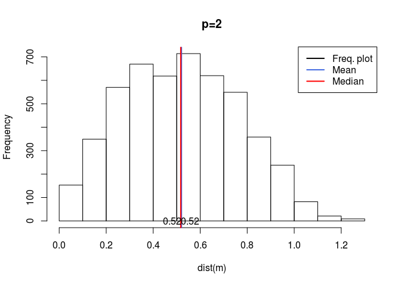
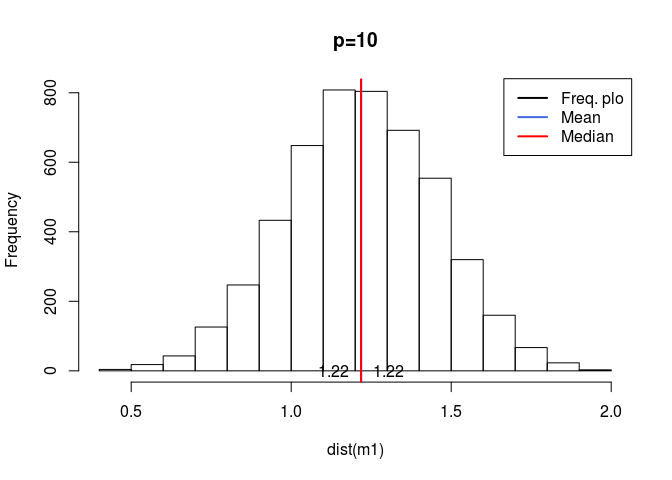
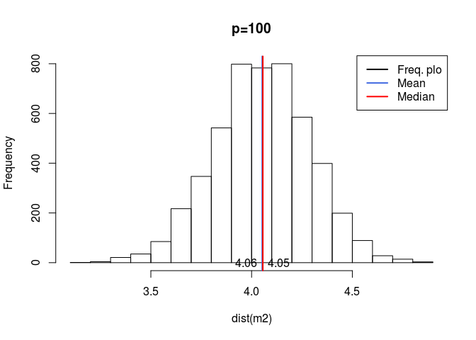
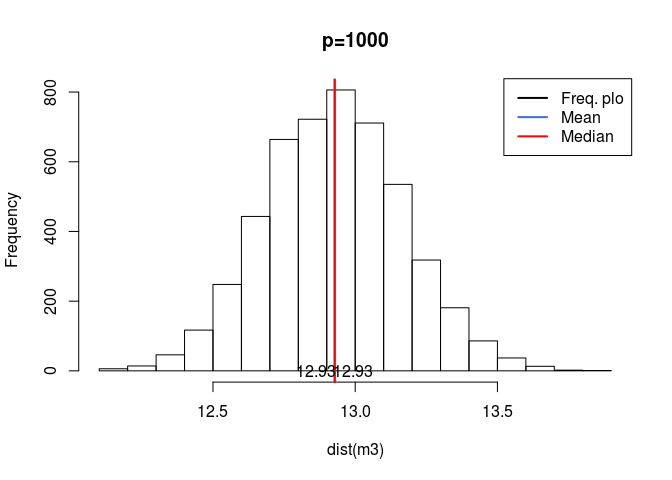

Curse of Dimensionality
=======================

Have you ever heard that some algorithms are not applicable to high dimension data? This is called curse of dimensionality. Here we show that if we draw samples of equal size (n=100) from different dimension (P=2, 10, 100) we will lead to different Euclidean distances from random points.

``` r
m<-matrix(runif(200),nrow=100);
m1<-matrix(runif(1000),nrow=100);
m2<-matrix(runif(10000),nrow=100);
m3<-matrix(runif(100000),nrow=100);


hist(dist(m), main="p=2")
abline(v = mean(dist(m)), col = "royalblue", lwd = 2)
abline(v = median(dist(m)), col = "red", lwd = 2)
legend(x = "topright", # location of legend within plot area
 c("Freq. plot", "Mean", "Median"),
 col = c("black", "royalblue", "red"),
 lwd = c(2, 2, 2))
text(1.07*mean(dist(m)), 0 , round(mean(dist(m)), 2))
text(.93*median(dist(m)), 0 , round(median(dist(m)), 2))
```



``` r
hist(dist(m1), main="p=10")
abline(v = mean(dist(m1)), col = "royalblue", lwd = 2)
abline(v = median(dist(m1)), col = "red", lwd = 2)
legend(x = "topright", # location of legend within plot area
 c("Freq. plo", "Mean", "Median"),
 col = c("black", "royalblue", "red"),
 lwd = c(2, 2, 2))
text(1.07*mean(dist(m1)), 0 , round(mean(dist(m1)), 2))
text(.93*median(dist(m1)), 0 , round(median(dist(m1)), 2))
```



``` r
hist(dist(m2),main="p=100")
abline(v = mean(dist(m2)), col = "royalblue", lwd = 2)
abline(v = median(dist(m2)), col = "red", lwd = 2)
legend(x = "topright", # location of legend within plot area
 c("Freq. plo", "Mean", "Median"),
 col = c("black", "royalblue", "red"),
 lwd = c(2, 2, 2))
text(1.02*mean(dist(m2)), 0 , round(mean(dist(m2)), 2))
text(.98*median(dist(m2)), 0 , round(median(dist(m2)), 2))
```



``` r
hist(dist(m3),main="p=1000")
abline(v = mean(dist(m3)), col = "royalblue", lwd = 2)
abline(v = median(dist(m3)), col = "red", lwd = 2)
legend(x = "topright", # location of legend within plot area
 c("Freq. plo", "Mean", "Median"),
 col = c("black", "royalblue", "red"),
 lwd = c(2, 2, 2))
text(1.005*mean(dist(m3)), 0 , round(mean(dist(m3)), 2))
text(.995*median(dist(m3)), 0 , round(median(dist(m3)), 2))
```



``` r
median(dist(m))
```

    ## [1] 0.5171521

``` r
median(dist(m1))
```

    ## [1] 1.218275

``` r
median(dist(m2))
```

    ## [1] 4.055708

``` r
median(dist(m3))
```

    ## [1] 12.92829

``` r
vp <-function(p,r){
  return((pi^(p/2))/(gamma((p/2)+1))*r^p)
}


1/vp(20,1)
```

    ## [1] 38.74934

``` r
1/vp(20,.1)
```

    ## [1] 3.874934e+21

``` r
1/vp(20,.01)
```

    ## [1] 3.874934e+41

``` r
1/vp(50,1)
```

    ## [1] 5.779614e+12

``` r
1/vp(50,.1)
```

    ## [1] 5.779614e+62

``` r
1/vp(50,.01)
```

    ## [1] 5.779614e+112

``` r
1/vp(200,1)
```

    ## [1] 1.798939e+108

``` r
1/vp(200,.1)
```

    ## [1] Inf

``` r
1/vp(200,.01)
```

    ## [1] Inf
